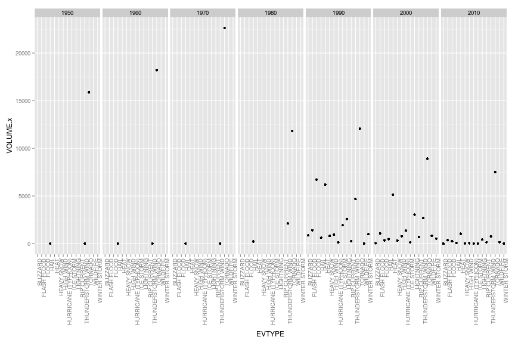
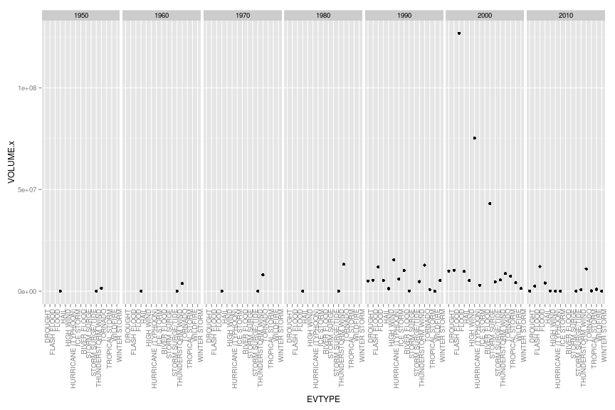
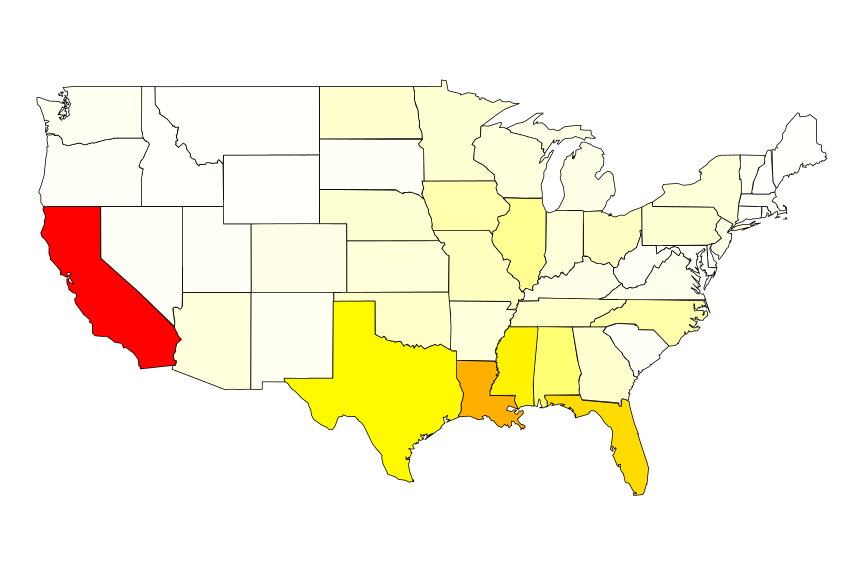

Impact of storm on U.S. health and economy
========================================================


# Synopsis
This is an R Markdown document. Markdown is a simple formatting syntax for authoring web pages (click the **Help** toolbar button for more details on using R Markdown).

# Data Processing
When you click the **Knit HTML** button a web page will be generated that includes both content as well as the output of any embedded R code chunks within the document. You can embed an R code chunk like this:


```r
storms<-readRDS("storms.rds")
```
Our analysis will concentrate on impact of different types of events across the decades.

## Defining decade
Decade will be defined as a year (rounded to the decade) of date that signifies beggining of the event `BGN_DATE`. Using `library(lubridate)` will prase the date stored in `BGN_DATE` using format of month-day-year hour:minutes:second. Then we do integral division to get decade and finally we factor the vector to save on memory.

```r
eventDecade<-factor((year(parse_date_time(storms$BGN_DATE, "m*!-d!-Y! H!:M!:S!"))%/%10)*10);
stormsEx<-cbind(storms, eventDecade);
```

## Cleanup of EVTYPE


```r
#cat("\014") 

events<-stormsEx[, "EVTYPE"]
events<-gsub("^\\s+|\\s+$", "", toupper(events))

events<-gsub("HVY", "HEAVY", events)
events<-gsub("FLOOOD", "FLOOD", events)
events<-gsub("FLD", "FLOOD", events)
events<-gsub("CSTL", "COASTAL", events)
events<-gsub("WND", "WIND", events)
events<-gsub("WAVES", "SURF", events)
events<-gsub("SWELLS", "SURF", events)
events<-gsub("SEAS", "SURF", events)
events<-gsub("WATER", "SURF", events)
events<-gsub("TIDES", "SURF", events)
events<-gsub("SHOWERS?", "RAIN", events)
events<-gsub("PRECIPITATION", "RAIN", events)
events<-gsub("PRECIPATATION", "RAIN", events)
events<-gsub("WET\\s+", "", events)
events<-gsub("URBAN", "", events)
events<-gsub("UNSURFONABLY", "", events)
events<-gsub("UNUSUAL[A-Z]*\\s+", "", events)
events<-gsub("SUMMARY.*", "?", events)

events<-gsub("^TSTM.*", "THUNDERSTORM WIND", events)
events<-gsub("^THUNDER.*", "THUNDERSTORM WIND", events)
events<-gsub("^BLIZZARD.*", "BLIZZARD", events)
events<-gsub("^COA?STAL.*FLOOD.*", "COASTAL FLOOD", events)
events<-gsub("^COLD(\\s+|/).*", "COLD/WIND CHILL", events)
events<-gsub("^HIGH\\s+WI?ND.*", "HIGH WIND", events)
events<-gsub("^EXTREME.*COLD.*", "EXTREME COLD/WIND CHILL", events)
events<-gsub("^EXTREME.*WIND.*", "EXTREME COLD/WIND CHILL", events)
events<-gsub("^HEAVY\\s+RAIN.*", "HEAVY RAIN", events)
events<-gsub("^HEAVY.*SNOW.*", "HEAVY SNOW", events)
events<-gsub("^HAIL.*", "HAIL", events)
events<-gsub("^FLASH.*FLOOD.*", "FLASH FLOOD", events)
events<-gsub("^FLOOD.*", "FLOOD", events)
events<-gsub(".*FUNNEL.*", "FUNNEL CLOUD", events)
events<-gsub("EARLY\\s+", "", events)
events<-gsub(".*FROST.*", "FROST/FREEZE", events)
events<-gsub(".*FREEZ.*", "FROST/FREEZE", events)
events<-gsub(".*HEAT.*", "HEAT", events)
events<-gsub("^HIGH\\s+SURF.*", "HIGH SURF", events)
events<-gsub("^HEAVY\\s+SURF.*", "HIGH SURF", events)
events<-gsub(".*HURRICANE.*", "HURRICANE (TYPHOON)", events)
events<-gsub(".*TYPHOON.*", "HURRICANE (TYPHOON)", events)
events<-gsub("^ICE\\s+.*", "ICE STORM", events)
events<-gsub("^LIGHTNING\\s+.*", "LIGHTNING", events)
events<-gsub("^TORNADO.*", "TORNADO", events)
events<-gsub(".*TROPICAL STORM.*", "TROPICAL STORM", events)
events<-gsub("CURRENTS","CURRENT", events)

stormsEx[, "EVTYPE"]<-factor(events)
```

## Across the United States, which types of events (as indicated in the EVTYPE variable) are most harmful with respect to population health?

We will agregate by sum of (`INJURIES` and `FATALITIES`) by `EVTYPE` and `eventDecade`

```r
healthByEvType<-aggregate (INJURIES+FATALITIES ~ EVTYPE + eventDecade, stormsEx, sum);
names(healthByEvType)<-c("EVTYPE", "eventDecade", "VOLUME")
```

To get top order of most influential events types, data will be summed up per event type and sorted in decreasing order.


```r
significantHealthEvType<-aggregate (VOLUME ~ EVTYPE, healthByEvType, sum);
significantHealthEvType<-significantHealthEvType[with(significantHealthEvType, order(-VOLUME)), ]
```

## Across the United States, which types of events have the greatest economic consequences?
Cleaning of property demage and crop demage magnitude (`PROPDMGEXP` & `CROPDMGEXP`). This two steps will allow for removing of incorrect
information in the data specific to demage estimation. 

```r
stormsEx[, "PROPDMGEXP"]<-gsub("^\\s+|\\s+$", "", toupper(stormsEx[, "PROPDMGEXP"]))
stormsEx[, "PROPDMGEXP"]<-factor(gsub("[^MB]","", stormsEx[, "PROPDMGEXP"]))

stormsEx[, "CROPDMGEXP"]<-gsub("^\\s+|\\s+$", "", toupper(stormsEx[, "CROPDMGEXP"]))
stormsEx[, "CROPDMGEXP"]<-factor(gsub("[^MB]","", stormsEx[, "CROPDMGEXP"]))
```

This will allow for moving `CROPDMG` and `PROPDMG` into same units (by multiplying by 1 000 and 1 000 000) so all values will be in
thousands of US dollars. 


```r
stormsEx <- within(stormsEx, CROPDMG[CROPDMGEXP=="M"] <- (CROPDMG[CROPDMGEXP=="M"]*10^3));
stormsEx <- within(stormsEx, CROPDMG[CROPDMGEXP=="B"] <- (CROPDMG[CROPDMGEXP=="B"]*10^6));
stormsEx <- within(stormsEx, PROPDMG[PROPDMGEXP=="M"] <- (PROPDMG[PROPDMGEXP=="M"]*10^3));
stormsEx <- within(stormsEx, PROPDMG[PROPDMGEXP=="B"] <- (PROPDMG[PROPDMGEXP=="B"]*10^6));
```

Those data (summarized`CROPDMG` and `PROPDMG` ) then will be agregated by type and event decade to see the aspect of economic
consequences.

```r
demageByEvType<-aggregate (PROPDMG+CROPDMG ~ EVTYPE + eventDecade, stormsEx, sum);
names(demageByEvType)<-c("EVTYPE", "eventDecade", "VOLUME")
```

To get top order of most influential events types, data will be summed up per event type and sorted in decreasing order.


```r
significantEconEvType<-aggregate (VOLUME ~ EVTYPE, demageByEvType, sum);
significantEconEvType<-significantEconEvType[with(significantEconEvType, order(-VOLUME)), ]
```

In addition will calculate economic cost per state:

```r
econCostPerState<-aggregate (PROPDMG+CROPDMG ~ STATE, stormsEx, sum);
names(econCostPerState)<-c("state", "cost")
statesDict<-read.csv("states.csv")
econCostPerStateEx<-merge(econCostPerState, statesDict, by.x="state", by.y="STATE", all.y=TRUE)
econCostPerStateEx<-econCostPerStateEx[with(econCostPerStateEx, order(cost)), ]
econCostPerStateEx<-econCostPerStateEx[complete.cases(econCostPerStateEx),]
econCostPerStateEx$STATE_NAME<-tolower(econCostPerStateEx$STATE_NAME)
```


# Results

Following section contains analysis of data obtained from cleaning up and agregating source data. One of main observations that can
be noted that there only 3 event types have health & economical impact between 1950s and 1980s. This is due to the fact that only three
events where tracked during this time: Tornado, Thunderstorm Wind and Hail (based on http://www.ncdc.noaa.gov/stormevents/details.jsp).
Since 1996 48 types of events are tracked. 

Complete comparisson through decades is therefore a hard to do. But values gather show some trends. Conclusions based on decade 2010-2020 have to be taken very carefully becasue this decade didn't end and presented values will go up.

## Healt impact
Since we have over 118 values we will plot only top 15 values (after cleanup done in data processing).

Following combination allows to scale down number of events shown in graph, by taking only values that are in TOP 15.

```r
combinedHealth<-merge(healthByEvType, significantHealthEvType[1:15,], by.x="EVTYPE", by.y="EVTYPE", all.x=TRUE)
combinedCleanedHealth<-subset(combinedHealth, is.na(VOLUME.y)==FALSE)
```

the plot shows:


```r
qplot(EVTYPE, VOLUME.x, data=combinedCleanedHealth, facets = . ~ eventDecade)+theme(axis.text.x = element_text(angle = 90, hjust = 1))
```

 

As we can infer from the plot 1970s were the most distinctive decade in terms of public health. After that the number of injuries and deaths is gradually going down. 


## Economical impact


```r
combinedEcon<-merge(demageByEvType, significantEconEvType[1:15,], by.x="EVTYPE", by.y="EVTYPE", all.x=TRUE)
combinedCleanedEcon<-subset(combinedEcon, is.na(VOLUME.y)==FALSE)
```

And the plot shows:


```r
qplot(EVTYPE, VOLUME.x, data=combinedCleanedEcon, facets = . ~ eventDecade)+theme(axis.text.x = element_text(angle = 90, hjust = 1))
```

 


## PerState
Based on http://sigmasmooth.wordpress.com/2012/07/12/stat-programming-workshop-tutorial-for-a-very-simple-r-choropleth-map/

```r
library(maps)
data(state)
mapnames <- map("state", plot=FALSE)$names
region_list <- strsplit(mapnames, ":")
mapnames2 <- sapply(region_list, "[", 1)
m <- match(mapnames2, econCostPerStateEx$STATE_NAME)
map.cost <- econCostPerStateEx$cost[m]
clr<-rev(heat.colors(200))
area.buckets<-cut(map.cost, breaks=200)
map("state", fill=TRUE, col=clr[area.buckets])
```

 

Top states:

```r
statesLen<-length(econCostPerStateEx$STATE_NAME)
rev(econCostPerStateEx[(statesLen-5):statesLen, c("cost", "STATE_NAME")])
```

```
##     STATE_NAME      cost
## 2      alabama  17848231
## 44       texas  33942595
## 26 mississippi  36419962
## 10     florida  45413633
## 19   louisiana  61302212
## 5   california 127115863
```

## Comparisson

```r
intersect (significantEconEvType[1:15,"EVTYPE"], significantHealthEvType[1:15,"EVTYPE"])
```

```
##  [1] "FLOOD"               "HURRICANE (TYPHOON)" "TORNADO"            
##  [4] "HAIL"                "FLASH FLOOD"         "THUNDERSTORM WIND"  
##  [7] "ICE STORM"           "WINTER STORM"        "HIGH WIND"          
## [10] "WILDFIRE"
```

```r
setdiff(significantEconEvType[1:15,"EVTYPE"], significantHealthEvType[1:15,"EVTYPE"])
```

```
## [1] "STORM SURGE"      "DROUGHT"          "RIVER FLOOD"     
## [4] "TROPICAL STORM"   "STORM SURGE/TIDE"
```

```r
setdiff(significantHealthEvType[1:15,"EVTYPE"], significantEconEvType[1:15,"EVTYPE"])
```

```
## [1] "HEAT"        "LIGHTNING"   "HEAVY SNOW"  "RIP CURRENT" "BLIZZARD"
```
